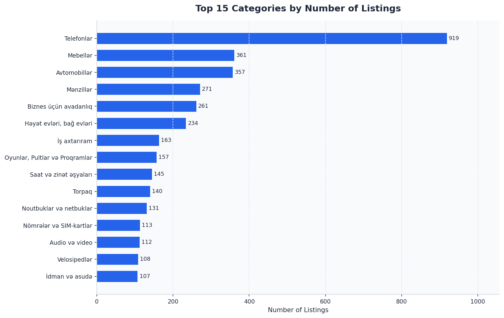
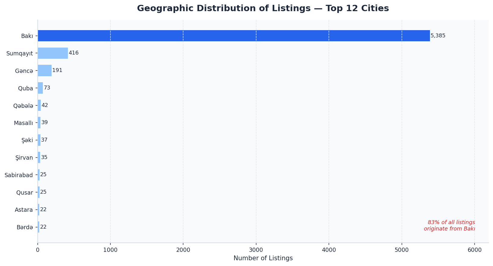
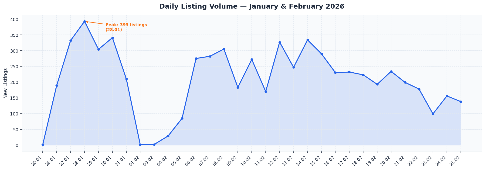
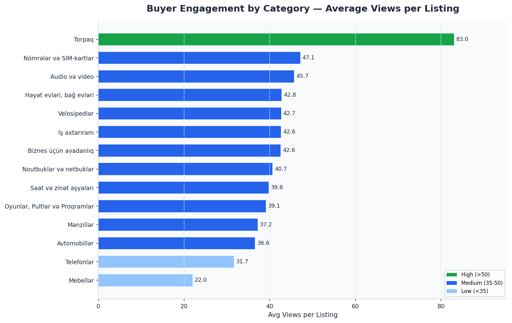
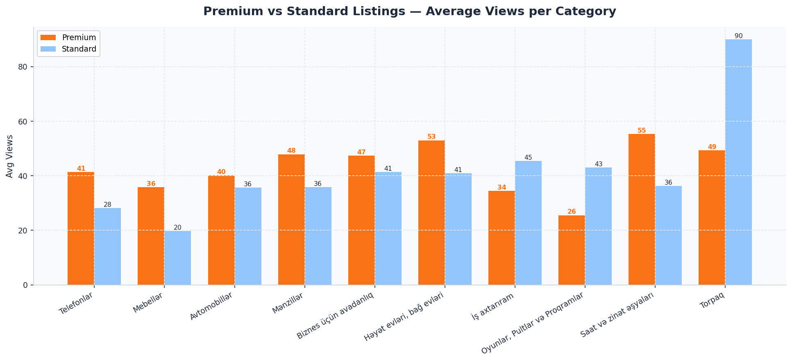
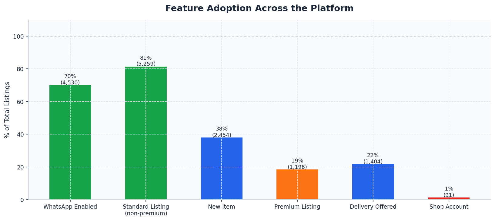
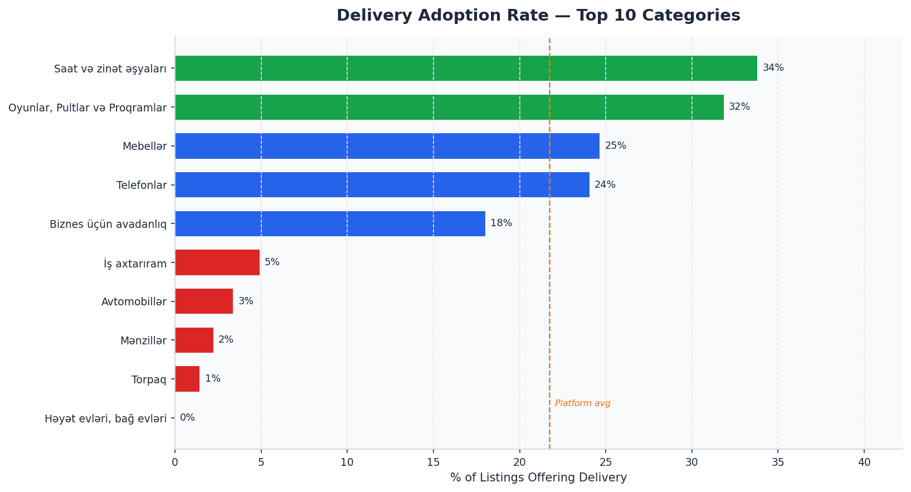
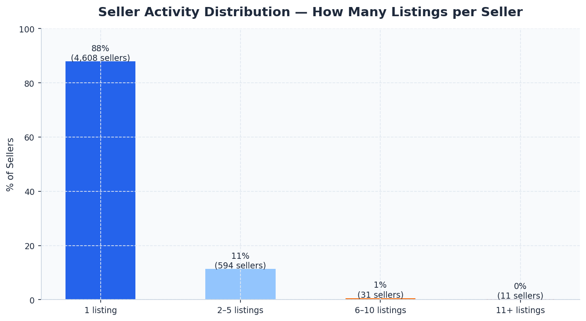
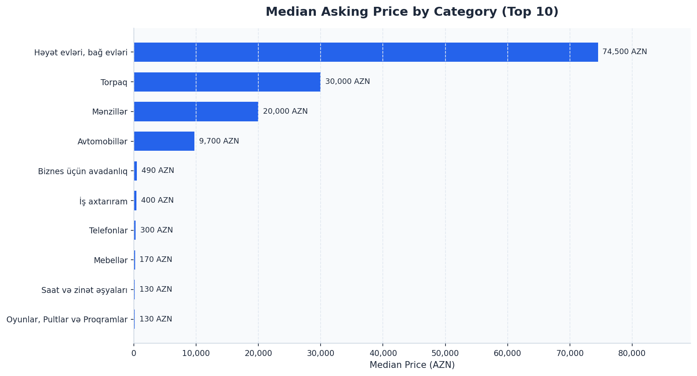
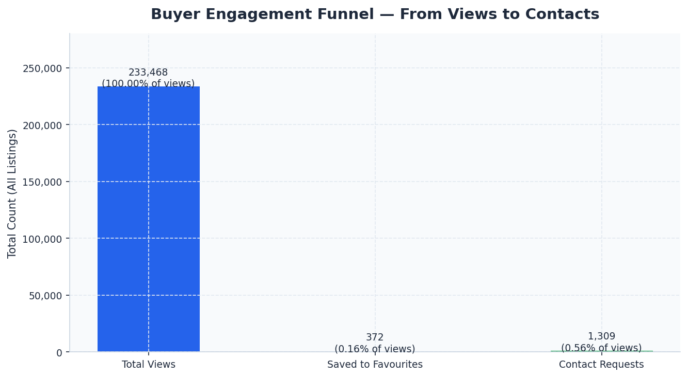

# Satiram.az — Marketplace Business Intelligence Report

> **Scope:** 6,457 active listings scraped from satiram.az on 25 February 2026
> **Audience:** Executive team, product owners, growth and operations leads

---

## Executive Summary

Satiram.az is a young but active Azerbaijani classifieds marketplace with a distinct profile: **heavily urban, seller-fragmented, and significantly under-monetised on buyer conversion**. The platform hosts listings across technology, real estate, vehicles, and consumer goods, but the data reveals concentrated geographic risk, untapped engagement signals, and a premium product that demonstrably works yet remains underutilised.

The findings below are each backed by a dedicated chart and translate directly into actionable decisions.

---

## Finding 1 — The Market Is Dominated by Three Categories

**What the chart shows:** Phones (Telefonlar) account for the single largest share of listings at 919, followed by Furniture (Mebellər) at 361 and Cars (Avtomobillər) at 357. Together, these three categories represent roughly **25% of the entire catalogue**.

**Why it matters:** Category concentration creates both an opportunity and a vulnerability. The platform has a natural anchor in consumer electronics and household goods — areas where repeat transactions and high inventory turnover are common. However, over-indexing in a single category means that any shift in buyer demand or a competitor entering that vertical could materially impact overall platform health.

**Decision to consider:** Invest in supply acquisition for mid-sized, high-engagement categories (Land, Real Estate, Business Equipment) that currently attract disproportionate buyer attention relative to their listing volume. A targeted seller incentive program in those categories would improve catalogue balance and reduce single-category dependency.

---

## Finding 2 — 83% of All Listings Come from One City

**What the chart shows:** Baku (Bakı) accounts for 5,385 out of 6,457 listings — **83% of the entire platform**. Sumqayıt is a distant second at 416, and all other cities combined represent less than 10%.

**Why it matters:** This is a significant geographic concentration risk. The platform's growth ceiling is directly linked to Baku's market size. Any economic or regulatory disruption in the capital would have an outsized platform-wide effect. Conversely, the rest of Azerbaijan — over 2.5 million people outside Baku — is nearly invisible in the catalogue.

**Decision to consider:** Launch a regional seller acquisition programme targeting Sumqayıt, Gəncə, Quba, and Qəbələ. Even modest growth in these cities would meaningfully diversify the supply base and open new buyer segments. Consider localised promotions or reduced fees for sellers in underrepresented regions.

---

## Finding 3 — The Platform Is Growing Steadily, With Clear Weekly Patterns

**What the chart shows:** Listing activity picked up sharply in late January 2026 and sustained strong daily volumes throughout February, peaking at over 300–330 listings on multiple days. A slight weekend dip is visible in the rhythm, with Mondays and Tuesdays typically seeing recovery.

**Why it matters:** The platform is in active growth, not stagnation. The consistent daily volumes confirm that seller behaviour has become habitual rather than seasonal. The mid-week peak pattern suggests that most sellers post during business hours, which has implications for when support resources and moderation capacity should be concentrated.

**Decision to consider:** Schedule promotional campaigns, email nudges, and paid media to launch on Sunday or Monday evening to align with the natural weekly posting wave. Use this weekly rhythm to time feature announcements and seller engagement touchpoints for maximum visibility.

---

## Finding 4 — Land and Property Attract the Most Buyer Attention Per Listing

**What the chart shows:** Land listings (Torpaq) average **83 views per listing** — nearly three times the platform average of 36. Houses and Garden Properties (Həyət evləri) average 43, as do Job Seekers (İş axtarıram) and Business Equipment (Biznes üçün avadanlıq). Furniture (Mebellər) and Phones (Telefonlar) — the most listed categories — are among the lowest in per-listing engagement.

**Why it matters:** High supply does not equal high demand. Land and Real Estate attract intense buyer interest with relatively few listings — a classic supply shortage. Meanwhile, the most populated categories (phones, furniture) are diluted with competition, driving per-listing visibility down.

**Decision to consider:** Introduce category-specific pricing strategies. Land and Property sellers may be willing to pay a premium for promotion given the high organic interest. Conversely, high-volume lower-engagement categories may benefit from bundle listing packages to sustain seller retention.

---

## Finding 5 — Premium Listings Deliver a Measurable View Advantage

**What the chart shows:** Across all major categories, premium listings consistently outperform standard listings in average views. The gap is most pronounced in Vehicles (Avtomobillər) and Real Estate categories, where premium placements generate significantly higher visibility. Platform-wide, premium listings average **43.5 views vs. 34.5 for standard** — a 26% uplift.

**Why it matters:** The premium product works. Sellers who invest in visibility receive a real and measurable return in buyer attention. The challenge is that only **1,198 out of 6,457 listings (18.5%) are premium** — the vast majority of the catalogue is competing in the standard tier.

**Decision to consider:** The 26% view uplift is a compelling upsell argument. Build a conversion funnel for standard-tier sellers: show them their own view count, benchmark it against the premium average in their category, and present the upgrade offer in context. A/B test in-platform notifications after a listing reaches 5 or 10 views with no contact.

---

## Finding 6 — WhatsApp Is the Primary Communication Channel; Delivery Is Underutilised

**What the chart shows:** 70% of listings have WhatsApp enabled, making it the dominant contact method on the platform. Meanwhile, delivery is offered by only **22% of sellers** — despite being one of the strongest trust signals a seller can provide. Shop accounts make up just 1.4% of the seller base.

**Why it matters:** The platform is highly WhatsApp-centric, which reflects consumer expectations in Azerbaijan. However, the low delivery adoption rate means that most transactions require in-person coordination — a friction point that limits conversion, especially for out-of-city buyers. Given that 83% of supply is Baku-based, non-Baku buyers face a significant barrier.

**Decision to consider:** Create a "Delivery Ready" badge and filter for buyers. Actively encourage sellers to enable delivery by surfacing data showing that delivery-enabled listings have higher contact rates. Consider partnering with a logistics provider to offer an integrated delivery option directly within the platform.

---

## Finding 7 — Delivery Adoption Is Especially Low in High-Value Categories

**What the chart shows:** Delivery adoption is almost zero for Real Estate (2%), Cars (3%), and Houses (0%) — where in-person inspection is expected. However, in consumer categories like Watches & Jewellery (34%), Games & Consoles (32%), and Phone Numbers/SIM Cards (34%), delivery adoption is meaningfully higher, yet still leaves two-thirds of sellers without the option.

**Why it matters:** For consumer electronics and accessories — exactly the categories with the most listings — delivery is both feasible and valuable for buyers. Sellers who do not offer delivery are limiting their reach to local buyers only, reducing the effective addressable market for each listing.

**Decision to consider:** Run a targeted campaign to phone, laptop, and accessories sellers encouraging delivery activation. Even raising adoption from 24% to 40% in the Phones category alone would affect ~150 additional listings and meaningfully improve buyer conversion for that segment.

---

## Finding 8 — The Seller Base Is Highly Fragmented

**What the chart shows:** Of 5,244 unique sellers on the platform, **88% (4,608 sellers) have posted exactly one listing**. Only 11% have 2–5 listings, and fewer than 1% are high-frequency sellers with 6 or more listings active simultaneously.

**Why it matters:** This fragmentation is characteristic of a classifieds platform in early growth — individual sellers clearing out items rather than professional merchants building inventory. While this is natural, it means that the platform is heavily dependent on continuous new seller acquisition to sustain supply. Retention of existing sellers is minimal because most have nothing left to sell after one transaction.

**Decision to consider:** Introduce a seller re-engagement programme: after a listing closes or expires, prompt the seller with "What else are you selling?" Encourage multi-listing behaviour from the start by offering a small incentive (e.g., free premium placement on a second listing). Identify the 642 sellers with 2+ listings as the core cohort to develop into power users and focus retention efforts there.

---

## Finding 9 — Real Estate Anchors the High-Value Segment

**What the chart shows:** Median prices vary enormously across categories. Houses and Garden Properties (74,500 AZN) and Apartments (20,000 AZN) dominate the high-value tier, followed by Cars (9,700 AZN). Consumer categories — Furniture (170 AZN), Phones (300 AZN), Bicycles (135 AZN) — occupy the affordable segment.

**Why it matters:** High-value categories (Real Estate, Vehicles) represent a disproportionate share of total transaction value on the platform. A single apartment sale or car transaction generates more economic activity than dozens of phone or furniture listings. Yet these categories have relatively few listings and, for Real Estate, no delivery friction to solve.

**Decision to consider:** Develop a premium tier specifically designed for Real Estate and Vehicles — one that includes professional photography prompts, optional agent verification, and featured placement. Given the transaction values involved, sellers in these categories can support higher platform fees. Even capturing a small commission or verification fee on high-value listings would materially impact revenue.

---

## Finding 10 — Buyer Conversion From Views to Action Is Extremely Low

**What the chart shows:** Across all 6,457 listings, the platform generated **233,455 total views**. Of those, only **392 resulted in a listing being saved to favourites (0.17%)**, and just **1,293 resulted in a contact request (0.55%)**. The vast majority of buyer intent evaporates after the initial browse.

**Why it matters:** A 0.55% view-to-contact rate signals a significant conversion gap. Buyers are browsing but not acting — either because listings lack sufficient information, because the contact experience has too much friction, or because buyers are not confident enough in what they see to reach out. This is the single most important metric to improve for platform health.

**Decision to consider:** Focus immediately on listing quality. Introduce a "Listing Completeness Score" visible to sellers showing what percentage of recommended fields they have filled in (description, images, price, delivery, WhatsApp). Listings with more complete information consistently perform better across all platforms. Additionally, consider adding a "Quick Enquiry" button with pre-filled templates (e.g., "Is this still available?") to reduce friction for buyers who are hesitant to initiate contact.

---

## Summary — Priority Actions

| Priority | Action | Supporting Finding |
|---|---|---|
| **1** | Launch regional seller acquisition in Sumqayıt, Gəncə, Quba | Finding 2 — 83% Baku concentration |
| **2** | Build in-app premium upsell flow for standard-tier sellers | Finding 5 — 26% view uplift from premium |
| **3** | Introduce listing completeness score to improve buyer conversion | Finding 10 — 0.55% view-to-contact rate |
| **4** | Develop high-value Real Estate & Vehicle premium tier | Finding 9 — Median property price 74,500 AZN |
| **5** | Run delivery activation campaign for electronics categories | Finding 7 — Only 24% of phone listings offer delivery |
| **6** | Seller re-engagement programme after first listing closes | Finding 8 — 88% of sellers have exactly one listing |
| **7** | Invest in supply for Land (Torpaq) category | Finding 4 — Highest avg views at 83 per listing |

---

*Report generated from 6,457 listings · Data as of 25 February 2026 · satiram.az*
